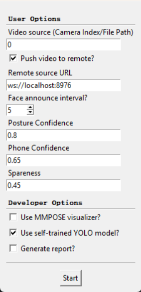

# Pedestrian Cell Phone Usage Detection - Inference Backend
> Alias: **YOU FOCUS YOUR WALK**


## Personnel
- **Group Members:** [Mai Jiajun](https://github.com/SpinningMai), [Huang Yanzhen](https://github.com/YanzhenHuang)
- **Supervisor:** Prof. Bob Zhang

## License
This repository uses the following project licensed under different licenses.
The full texts are available in the [LICENSES](LICENSES) directory.

| Component   | Type       | LICENSE File (Local)                                                             | Source (with License)                      |
|-------------|------------|----------------------------------------------------------------------------------|--------------------------------------------|
| Open-MMLab  | Apache-2.0 | [LICENSES/Apache_Open-MMLab/LICENSE.txt](LICENSES/Apache_Open-MMLab/LICENSE.txt) | https://github.com/open-mmlab              |
| ultralytics | AGPL-3.0   | [LICENSES/AGPL_ultralytics/LICENSE.txt](LICENSES/AGPL_ultralytics/LICENSE.txt)   | https://github.com/ultralytics/ultralytics |

More credits and copyrights info about ultralytics is in [main.py](main.py).

## Assets

> [!NOTE] This is just a reference to the available sources. Please strictly follow the guidelines in the 
> [Configure Project](#Configure-Project) section.

### RTMPose Model Config and Checkpoints

The model configs and checkpoints are stored in [Google Drive](https://drive.google.com/drive/u/0/folders/1Oe6Z2GqkqDfGxmH2_x6f2wKSK0HIoEm9).
Please download all of them and copy it into [model_config/checkpoints](model_config/checkpoints) and [model_config/configs](model_config/configs)
respectively.

For integrity, you may also refer to the official source listed in below sections. We store them because the official source
download speed may be slow.

### Posture Recognition Models

Trained models & training logs are stored under [Google Drive](https://drive.google.com/drive/folders/1DMO_cD-R3kO3tm_UTNezu3rM7ynG_hMj?usp=sharing).

Model referred in the project: `posture_mmpose_vgg3d_0508-132048.pth`.

### YOLO Models
YOLO models are contained in this GitHub repository. Find it [here](step03_yolo_phone_detection/archived_onnx).

## Configure Project

> A quick start: The entry of this project is [main.py](main.py). Come back and run this file
> when you are done configuring.

### Step 0. Conda

Please make sure that [Anaconda](https://www.anaconda.com/) is installed.

Please make sure that you are under the conda environment. If you are not, please do the following in the 
anaconda prompt terminal to create one.

#### 0.1 Create Virtual Environment

```shell
conda create --prefix <PATH_TO_YOUR_VENV_ROOT_FOLDER> python=3.8 -y
```

#### 0.2 Activate Virtual Environment

```shell
conda activate <PATH_TO_YOUR_VENV_ROOT_FOLDER>
```

#### 0.3 Go to Project Dir

```shell
cd <PATH_TO_YOUR_CLONED_PROJECT>
```

### Step 1. Install Pytorch

We have inspected that `mmcv` does not work with pytorch with a higher version. Under a higher torch version, `cuda:0`
is not available, eventhough `torch.cuda.is_available()` returns `True`.

According to this issue: https://github.com/open-mmlab/mmdetection/issues/11530#issuecomment-1996359661, 
`mmcv` only works with pytorch with version `2.1.0`. And it has been confirmed by us. Please run:

```shell
conda install pytorch==2.1.0 torchvision==0.16.0 torchaudio==2.1.0 pytorch-cuda=11.8 -c pytorch -c nvidia
```

You should have these installed:

| Package            | Build                   |
|--------------------|-------------------------|
| pytorch-2.1.0      | py3.8_cuda11.8_cudnn8_0 |
| torchaudio-2.1.0   | py38_cu118              |
| torchvision-0.16.0 | py38_cu118              |

### 2. Install MM Packages

#### 2.1 Openmim

After activating your conda environment, pleas install openmim package manager.
For Windows users, please run:

```shell
<PATH_TO_YOUR_VIRTUAL_ENVIRONMENT>/Scripts/pip.exe install -U openmim
```

For Mac users, please run:

```shell
<PATH_TO_YOUR_VIRTUAL_ENVIRONMENT>/bin/pip install -U openmim
```

The absolute path to your pip executable is preferred to ensure that you have used the correct pip. 
Using a wrong instance of pip will cause your packages to be downloaded to the wrong environment.

#### 2.2 MM Packages

There are four MM packages you need to install. Please install the EXACT version listed in the form below. 
This is the best solution we could get to prevent package conflicts. For more information, please visit 
<https://mmcv.readthedocs.io/en/latest/get_started/installation.html>.

| Package  | Version | Source                                    |
|----------|---------|-------------------------------------------|
| mmcv     | 2.1.0   | https://github.com/open-mmlab/mmcv        |
| mmdet    | 3.2.0   | https://github.com/open-mmlab/mmdetection |
| mmengine | 0.10.4  | https://github.com/open-mmlab/mmengine    |
| mmpose   | 1.3.2   | https://github.com/open-mmlab/mmpose      |

Run this command to install MM related packages:

```shell
mim install "mmcv==2.1.0" "mmdet==3.2.0" "mmengine==0.10.4" "mmpose==1.3.2"
```

If you encounter an error while installing `mmcv` like this:

```shell
error: Microsoft Visual C++ 14.0 or greater is required. Get it with "Microsoft C++ Build Tools": https://visualstudio.microsoft.com/visual-cpp-build-tools/
```

You are missing a C++ requirement. Please download C++ build tools using the given link, and configure a C++ environment.
Please inspect this link for more details about C++ environment configuration: https://blog.csdn.net/xiao_yan_/article/details/119538602.

This is highly-likely a windows-only problem, considering macOS has its own gcc. If you use a mac and also received
similar errors, please don't hesitate to propose an issue.

#### 2.3 Checkpoint and Configuration Files

For both boundary detection and pose estimation, there are two kinds of files: Config files and Checkpoint files.

Please download all of them by clicking these links:

**`.py` Files** (No longer need manual downloading)

> [!NOTE]
> You can skip this step, since the config `.py` files have been re-included into the GitHub repo,
> in [model_config/configs](model_config/configs). 
> However, you can still choose to download them from URLs listed below.

- config files (`.py`):
  - det config (boundary detection): https://github.com/open-mmlab/mmpose/blob/dev-1.x/projects/rtmpose/rtmdet/person/rtmdet_nano_320-8xb32_coco-person.py
  - pose config (pose estimation): https://github.com/open-mmlab/mmpose/blob/dev-1.x/projects/rtmpose/rtmpose/body_2d_keypoint/rtmpose-t_8xb256-420e_coco-256x192.py

After downloading from the browser, please move them into [model_config/configs/](model_config/configs/). 
You may need to create this folder first.

**`.pth` Files**

> [!NOTE]
> The below downloading method is too slow in efficiency. We have put all the available configurations in our 
> Google Drive. Link: https://drive.google.com/drive/folders/1Jsjhnrq4tJselSn-zU-yulNmpRycgSu2?usp=sharing.
> Please download ALL of them (may contain redundant ones) and put them in `model_config/checkpoints/`, where the 
> contents in this folder are ignored. If you prefer to download from source, please refer to the links below.

- checkpoint files (`.pth`):
  - det checkpoint: https://download.openmmlab.com/mmpose/v1/projects/rtmpose/rtmdet_nano_8xb32-100e_coco-obj365-person-05d8511e.pth
  - pose checkpoint: https://download.openmmlab.com/mmpose/v1/projects/rtmposev1/rtmpose-tiny_simcc-aic-coco_pt-aic-coco_420e-256x192-cfc8f33d_20230126.pth

After downloading from the browser, please move them into [model_config/checkpoints/](model_config/checkpoints/). 
You may need to create this folder first.

### 3. Regular Packages
Run the following command to install regular required packages.

For windows:
```shell
<PATH_TO_YOUR_VIRTUAL_ENVIRONMENT>/Scripts/pip.exe install -r requirements.txt
```

Try to run `main.py`. If an error regarding `opencv-python` occurred, uninstall it and re-install it again.

```shell
<PATH_TO_YOUR_VIRTUAL_ENVIRONMENT>/Scripts/pip.exe uninstall opencv-python
```

```shell
<PATH_TO_YOUR_VIRTUAL_ENVIRONMENT>/Scripts/pip.exe install opencv-python
```

## Run Project

### 1. Run Method

**Option 1. Run via command.**

Direct to the root of the inference backend project folder (where `main.py` is stored).

```shell
cd <PATH_TO_YOUR_CLONED_PROJECT>
```

Run the correct python executable on the main file `main.py`.

```shell
<PATH_TO_YOUR_VIRTUAL_ENVIRONMENT>/python.exe -m main
```

> Disambiguation: `-m` means to run as a package, so it's specified as `main` instead of `main.py`

**Option 2. Run via IDE**

Run by click the `run` button on supported IDEs (e.g., VSCode, PyCharm, etc.). Please make sure the
IDE reads the virtual environment correspondingly.

### 2. Adjustable Parameters

When you run the project, you will encounter a pop-up panel that allows you to choose some parameters.



The meaning and default values of these parameters are listed below.

| Parameter                     | Default | Type            | Description                                                                                       |
|-------------------------------|---------|-----------------|---------------------------------------------------------------------------------------------------|
| `Video Source`                | 0       | `int \| string` | The source of video monitoring. Could be digit for camera index or string for video paths.        | 
| `Push video to remote`        | true    | `bool`          | Whether to push the video feed to the frontend or use local OpenCV window.                        |
| `Face announce interval`      | 5       | `int`           | The time length of the cool-down window of face announcing.                                       |
| `Posture Confidence`          | 0.8     | `float`         | The confidence threshold for reporting an engagement behavior.                                    |
| `Phone Confidence`            | 0.65    | `float`         | The confidence threshold for cell phone detection.                                                |
| `Spareness`                   | 0.45    | `float`         | The degree to which the secondary hand is spared when no cell phone detected in the primary hand. |
| `Use MMPose visualizer`       | false   | `bool`          | To use the MMPose visualizer or not.                                                              |
| `Use Self-trained YOLO model` | true    | `bool`          | To use a self-trained YOLO model instead of the official one.                                     |
| `Generate report`             | false   | `bool`          | To generate a real-time performance graph of mean frame computation time.                         |

